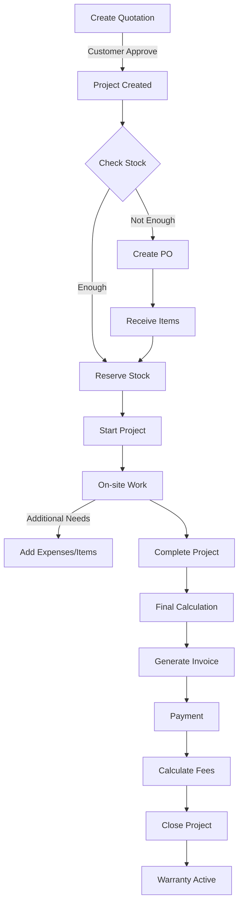

# Sistem Manajemen Penjualan CCTV & Networking

## 📋 Project Overview

Sistem manajemen penjualan untuk bisnis CCTV dan jaringan yang beroperasi dengan model project-based. Dijalankan oleh solo entrepreneur yang menangani semua aspek bisnis dari survey hingga after-sales.

## 🎯 Business Context

### Karakteristik Bisnis

- **Model**: Project-based (tidak ada harga fixed, setiap project unique)
- **Operator**: Solo entrepreneur + 1-2 freelance teknisi
- **Scope Kerja**: Survey → Quotation → Dealing → Procurement → Installation → Payment → After-sales
- **Pain Points**:
  - Tidak ada tracking yang terstruktur
  - Difficulty managing multiple projects simultaneously
  - No warranty/maintenance tracking
  - Manual calculation untuk fee dan margin

## 🔧 Tech Stack

- **Framework**: Nuxt 3
- **UI**: Tailwind CSS + DaisyUI 5
- **Database**: PostgreSQL
- **ORM**: Prisma
- **Timeline**: 2 minggu development
- **Platform**: Web first (mobile later)

## 📊 Database Schema

```prisma
// Main Entities

model Company {
  id        String   @id @default(cuid())
  name      String
  settings  Json     // Company settings like margin percentage, etc
  createdAt DateTime @default(now())
  updatedAt DateTime @updatedAt
}

model Customer {
  id           String    @id @default(cuid())
  name         String
  companyName  String?
  phone        String
  email        String?
  address      String
  notes        String?   // Preferences, key contacts
  projects     Project[]
  createdAt    DateTime  @default(now())
  updatedAt    DateTime  @updatedAt
}

model Project {
  id              String          @id @default(cuid())
  projectNumber   String          @unique // AUTO:  PRJ-YYYYMM-XXX
  customerId      String
  customer        Customer        @relation(fields:  [customerId], references: [id])
  title           String
  description     String?
  status          ProjectStatus   @default(QUOTATION)
  budget          Decimal
  actualCost      Decimal         @default(0)
  finalPrice      Decimal?
  paymentTerms    Json            // {type: 'FULL'|'DP', details: {...}}
  startDate       DateTime?
  endDate         DateTime?
  quotations      Quotation[]
  purchaseOrders  PurchaseOrder[]
  expenses        ProjectExpense[]
  payments        Payment[]
  items           ProjectItem[]
  warranty        Warranty[]
  createdAt       DateTime        @default(now())
  updatedAt       DateTime        @updatedAt
}

enum ProjectStatus {
  QUOTATION
  APPROVED
  PROCUREMENT
  ONGOING
  COMPLETED
  PAID
  CLOSED
}

model Quotation {
  id            String    @id @default(cuid())
  quotationNo   String    @unique // AUTO:  QT-YYYYMM-XXX
  projectId     String
  project       Project   @relation(fields: [projectId], references:  [id])
  items         Json      // Array of items with price
  totalAmount   Decimal
  status        String    @default("DRAFT") // DRAFT, SENT, APPROVED, REJECTED
  validUntil    DateTime
  notes         String?
  createdAt     DateTime  @default(now())
  updatedAt     DateTime  @updatedAt
}

model Product {
  id            String    @id @default(cuid())
  sku           String    @unique
  name          String
  category      String    // CCTV, NETWORK, ACCESSORIES, SERVICE
  unit          String    // pcs, meter, set, etc
  purchasePrice Decimal   @default(0)
  sellingPrice  Decimal   @default(0)
  minStock      Int       @default(0)
  stock         Stock?
  suppliers     SupplierProduct[]
  createdAt     DateTime  @default(now())
  updatedAt     DateTime  @updatedAt
}

model Stock {
  id            String    @id @default(cuid())
  productId     String    @unique
  product       Product   @relation(fields: [productId], references: [id])
  quantity      Int       @default(0)
  reserved      Int       @default(0)  // Reserved for projects
  available     Int       @default(0)  // quantity - reserved
  lastUpdated   DateTime  @updatedAt
}

model Supplier {
  id            String            @id @default(cuid())
  name          String
  contactPerson String?
  phone         String
  email         String?
  address       String?
  products      SupplierProduct[]
  purchaseOrders PurchaseOrder[]
  createdAt     DateTime          @default(now())
  updatedAt     DateTime          @updatedAt
}

model SupplierProduct {
  id          String    @id @default(cuid())
  supplierId  String
  supplier    Supplier  @relation(fields: [supplierId], references: [id])
  productId   String
  product     Product   @relation(fields:  [productId], references: [id])
  price       Decimal
  isActive    Boolean   @default(true)

  @@unique([supplierId, productId])
}

model PurchaseOrder {
  id            String    @id @default(cuid())
  poNumber      String    @unique // AUTO: PO-YYYYMM-XXX
  projectId     String?
  project       Project?  @relation(fields: [projectId], references: [id])
  supplierId    String
  supplier      Supplier  @relation(fields:  [supplierId], references: [id])
  items         Json      // Array of {productId, quantity, price}
  totalAmount   Decimal
  status        String    @default("DRAFT") // DRAFT, SENT, PARTIAL, RECEIVED
  receivedDate  DateTime?
  notes         String?
  createdAt     DateTime  @default(now())
  updatedAt     DateTime  @updatedAt
}

model ProjectItem {
  id          String    @id @default(cuid())
  projectId   String
  project     Project   @relation(fields: [projectId], references: [id])
  productId   String?
  name        String    // Product name or custom item
  quantity    Int
  unit        String
  price       Decimal
  totalPrice  Decimal
  type        String    // QUOTATION, ACTUAL, ADDITIONAL
  addedAt     DateTime  @default(now())
}

model ProjectExpense {
  id          String    @id @default(cuid())
  projectId   String
  project     Project   @relation(fields: [projectId], references: [id])
  category    String    // TRANSPORT, MEAL, TOOL, OTHER
  description String
  amount      Decimal
  receipt     String?   // Path to receipt image
  date        DateTime
  createdAt   DateTime  @default(now())
}

model Payment {
  id            String    @id @default(cuid())
  projectId     String
  project       Project   @relation(fields: [projectId], references: [id])
  amount        Decimal
  type          String    // DP, TERMIN_1, FINAL, etc
  method        String    // CASH, TRANSFER
  status        String    @default("PENDING") // PENDING, PAID
  paidDate      DateTime?
  dueDate       DateTime
  notes         String?
  createdAt     DateTime  @default(now())
  updatedAt     DateTime  @updatedAt
}

model Technician {
  id            String    @id @default(cuid())
  name          String
  phone         String
  type          String    @default("FREELANCE") // FREELANCE, INTERNAL
  feeType       String    @default("PERCENTAGE") // PERCENTAGE, FIXED, CUSTOM
  feePercentage Decimal?   // Default percentage
  minFee        Decimal   @default(150000) // Minimum fee for small projects
  assignments   ProjectTechnician[]
  createdAt     DateTime  @default(now())
  updatedAt     DateTime  @updatedAt
}

model ProjectTechnician {
  id           String     @id @default(cuid())
  projectId    String
  technicianId String
  technician   Technician @relation(fields: [technicianId], references: [id])
  fee          Decimal
  feeType      String     // How fee was calculated
  isPaid       Boolean    @default(false)
  paidDate     DateTime?
  notes        String?
  createdAt    DateTime   @default(now())
}

model Warranty {
  id            String    @id @default(cuid())
  projectId     String
  project       Project   @relation(fields: [projectId], references: [id])
  itemName      String
  warrantyType  String    // PRODUCT, SERVICE
  supplier      String?    // Supplier name for product warranty
  startDate     DateTime
  endDate       DateTime
  status        String    @default("ACTIVE") // ACTIVE, EXPIRED, CLAIMED
  notes         String?
  services      MaintenanceService[]
  createdAt     DateTime  @default(now())
  updatedAt     DateTime  @updatedAt
}

model MaintenanceService {
  id          String    @id @default(cuid())
  warrantyId  String?
  warranty    Warranty? @relation(fields: [warrantyId], references: [id])
  customerId  String
  serviceDate DateTime
  serviceType String    // ROUTINE, COMPLAINT, EMERGENCY
  issue       String?
  solution    String?
  technician  String?
  cost        Decimal   @default(0)
  status      String    @default("SCHEDULED") // SCHEDULED, COMPLETED
  nextService DateTime?
  createdAt   DateTime  @default(now())
  updatedAt   DateTime  @updatedAt
}

model FinancialSummary {
  id            String    @id @default(cuid())
  projectId     String    @unique
  revenue       Decimal   // Final price from customer
  totalCost     Decimal   // All costs
  grossMargin   Decimal   // Revenue - Cost
  marginPercent Decimal   // (Margin/Revenue)*100
  technicianFee Decimal   // Total technician fees
  companyFund   Decimal   // 35% of margin
  netProfit     Decimal   // Remaining after distribution
  calculated    DateTime  @default(now())
}
```

## 🔄 Business Flow

### 1. Main Project Flow



### 2. Financial Flow

```
Project Value (100%)
├── Material Cost (from PO)
├── Additional Purchases
├── Operational Expenses
└── Gross Margin
    ├── Technician Fee (10-15% or minimum Rp 150,000)
    ├── Company Fund (35% of margin)
    └── Net Profit (remaining)
```

## 🎨 UI/UX Requirements

### Dashboard Priority

1. **Today's Tasks** - Survey schedule, follow-ups
2. **Alerts** - Overdue payments, low stock, warranty expiring
3. **Quick Actions** - Create quote, new project, check stock
4. **Pipeline View** - Projects by status with values

### Key Features

#### Phase 1 (Week 1) - Core Features

1. **Customer Management**
   - Basic CRUD
   - Project history view
2. **Quotation System**
   - Create/edit quotations
   - Templates for common setups (e.g., 4 CCTV + DVR package)
   - Convert to project
3. **Project Management**
   - Status tracking
   - Budget vs actual monitoring
   - Payment terms setting
4. **Basic Inventory**
   - Product master
   - Virtual stock tracking
   - Stock reservation system

#### Phase 2 (Week 2) - Financial & Operational

1. **Purchase Orders**
   - Multi-supplier PO
   - Item receiving
2. **Expense Tracking**
   - On-site expense entry
   - Receipt photo upload
3. **Payment & Invoicing**
   - Payment recording
   - Invoice generation
   - Payment reminders
4. **Fee Calculation**
   - Automatic technician fee
   - Company fund (35%)
   - Margin analysis
5. **Warranty System**
   - Warranty registration
   - Expiry alerts
   - Service history

## 📱 Pages Structure

```
/
├── dashboard/
├── customers/
│   ├── index
│   ├── [id]/
│   └── create
├── projects/
│   ├── index
│   ├── [id]/
│   │   ├── overview
│   │   ├── quotation
│   │   ├── purchases
│   │   ├── expenses
│   │   ├── payments
│   │   └── warranty
│   └── create
├── quotations/
│   ├── index
│   ├── [id]/
│   └── create
├── inventory/
│   ├── products
│   ├── stock
│   └── suppliers
├── purchases/
│   ├── index
│   ├── [id]/
│   └── create
├── finance/
│   ├── payments
│   ├── expenses
│   └── reports
├── maintenance/
│   ├── warranty
│   └── schedule
└── settings/
    ├── company
    ├── technicians
    └── templates
```

## 🔧 Component Structure

### Key Components Needed

```vue
<!-- Priority Components -->
<ProjectCard />
- Status, progress, alerts
<QuotationBuilder />
- Dynamic item addition with pricing
<StockChecker />
- Real-time availability check
<POGenerator />
- Multi-supplier split
<ExpenseQuickAdd />
- Mobile-friendly expense entry
<PaymentTracker />
- Visual payment status
<FeeCalculator />
- Transparent fee breakdown
<WarrantyCard />
- Warranty status and alerts

<!-- Form Components -->
<CustomerForm />
<ProjectForm />
<ProductForm />
<PaymentForm />

<!-- Dashboard Widgets -->
<TodayTasks />
<RevenueChart />
<ProjectPipeline />
<AlertsPanel />
```

## 🚀 Implementation Notes

### Critical Business Rules

1. **Project Creation**: Only after quotation approval
2. **Stock**: Virtual warehouse with reservation system
3. **PO**: Can split to multiple suppliers per item
4. **Technician Fee**:
   - Percentage based (10-15%) for normal projects
   - Minimum Rp 150,000 for small/maintenance projects
   - Customizable per project
5. **Company Fund**: Fixed 35% of gross margin
6. **Warranty**: Auto-start after project completion
7. **Payment Terms**: Flexible (DP/Full/Termin)

### Mobile Considerations

- Large buttons for on-site use
- Offline capability for expense entry
- Photo upload for receipts
- Quick search for products
- WhatsApp integration preparation

### Performance Optimizations

- Lazy load heavy components
- Pagination for lists
- Cache frequent queries
- Debounce search inputs
- Optimize image uploads

### Security Considerations

- Authentication required
- Role-based access (future: for technicians)
- Audit trail for financial transactions
- Backup strategy for data

## 📊 Sample Data Structure

### Quotation Items Format

```json
{
  "items": [
    {
      "productId": "clxxx",
      "name": "CCTV Hikvision 2MP",
      "quantity": 4,
      "unit": "pcs",
      "price": 450000,
      "total": 1800000
    },
    {
      "productId": null,
      "name": "Installation & Configuration",
      "quantity": 1,
      "unit": "lot",
      "price": 500000,
      "total": 500000
    }
  ]
}
```

### Payment Terms Format

```json
{
  "type": "WITH_DP",
  "terms": {
    "dp": {
      "percentage": 30,
      "amount": 690000,
      "dueDate": "2024-01-15"
    },
    "final": {
      "percentage": 70,
      "amount": 1610000,
      "dueDate": "project_complete"
    }
  }
}
```

## 🎯 Success Metrics

1. Time saved in project management (target: 50% reduction)
2. Payment collection improvement (on-time payment tracking)
3. Customer retention through maintenance tracking
4. Margin visibility and optimization
5. Zero missed warranty claims

## 🐛 Common Scenarios to Handle

1. **Project Over Budget**: Alert when expenses exceed 90% budget
2. **Stock Shortage**: Auto-generate PO suggestions
3. **Payment Overdue**: Escalating reminder system
4. **Warranty Expiring**: 30-day advance notice
5. **Negative Margin**: Block project completion, require review

## 📝 For AI Agent Instructions

When implementing this system:

1. **Start with**: Database schema setup using Prisma
2. **Priority order**: Customer → Quotation → Project → Inventory → Financial
3. **Use**: Composition API in Vue 3, TypeScript when possible
4. **State Management**: Pinia for global state
5. **Validation**: Zod for form validation
6. **Date handling**: dayjs for date manipulation
7. **Currency**: Format all money values to IDR (Rupiah)
8. **Auto-generate**: Project numbers, quotation numbers, PO numbers
9. **Testing**: Focus on financial calculations accuracy
10. **Error Handling**: User-friendly messages in Indonesian

## 🔍 Sample Queries Needed

```sql
-- Dashboard queries
1. Today's tasks (surveys, installations, follow-ups)
2. Overdue payments with customer details
3. Projects nearing budget limit
4. Low stock alerts
5. Monthly revenue and margin trends
6. Warranty expiring in 30 days
7. Unpaid technician fees
8. Top customers by revenue

-- Report queries
1. Project profitability report
2. Customer lifetime value
3. Product movement report
4. Technician performance
5. Cash flow statement
```

Remember: This is a PRACTICAL tool for a solo entrepreneur, not enterprise software. Keep it simple, fast, and mobile-friendly!
